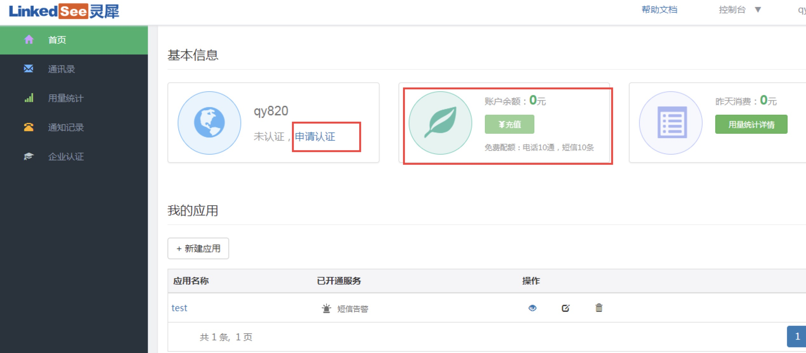

<!-- toc -->

# Mail, SMS, Wechat and phonecall sending port

When alarm generateded alarm information needs to be    sent via mail or SMS. Every company may have their own mail server and mail sending, or their own SMS channel and SMS sending method. Falcon has a common standard of port access that can suit every company. It needs every company to provide its http port for sending mail and SMS. 

##### Http port fir sending SMS:

```
method: post
params:
  - content: content of the SMS
  - tos: phone numbers separated by comma
```

##### Http port for sending mail:

```
method: post
params:
  - content: content of the mail
  - subject: subject of the mail
  - tos: mail addresses separated by comma
```

##### Http port for sending IM:

```
method: post
params:
  - content: content of the IM
  - tos: IM numbers separated by comma
```

However, you can use the `Mail Gateway` and `Wechat Gateway` provided by the community, or [Cloud Alarm Channel] provided by LinkedSee (http://t.cn/RpkS0d2).

- [Mail Gateway](https://github.com/open-falcon/mail-provider)
- [Wechat Gateway](https://github.com/Yanjunhui/chat)

----
# LinkedSee SMS/Phonecall Alarm Cloud Channel Port Access
Currently, Open-falcon supports LinkedSee SMS/Phonecall  alarm cloud channel via quick API access. You only need one API to access Open-Falcon quickly and get alarm feature with alarm compression ratio over 90%. Here are the steps of how to access SMS/Phonecall alarm cloud channel:

#### 1: Sign Up for LinkedSee Cloud Channel
LinkedSee Cloud Channel is a channel exclusively designed for alarm in IT operation. Multi-channel access makes data jamming least possible. It supports analysis based on key words in alarm content and combination of similar events, so you can get a clear recognition of the issue in no time. Please sign up an account [Here](http://t.cn/RpkS0d2) for the standard version of LinkedSee and activate your cloud channel service. If you already have an account, Or you can just log in. 


 
#### 2、Create the Application
After logging in for , go to the console and click Cloud Channel to enter Workbench. Then click New Application and Create Application like the picture below. Name the new application and save.
 

Currently, the cloud channel supports alarming and informing via SMS and phonecall. The setting of alarming via SMS and mail is on by default when an application is created. In order to receive all alarms, please make sure these settings are on.

#### 3、Acquire the Token of Application
After the application is created, click Check Token as shown in the picture below:

<font color="blue">附注：Token is used in following Api access steps。Please save a copy for later use.</font>
 

#### 4、URL Combination
After acquiring the token, you need to add it to the alarm URL of LinkedSee Cloud Channel:

- The address for sending SMS is: https://www.linkedsee.com/alarm/falcon_sms/`this_is_your_token`
- The address for sending voicecall is: https://www.linkedsee.com/alarm/falcon_voice/`this_is_your_token`

If the token of the application you created is d7a11a42aeac6848c3a389622f8, then:

- The address for sending SMS is https://www.linkedsee.com/alarm/falcon_sms/d7a11a42aeac6848c3a389622f8
- The address for sending phonecall is https://www.linkedsee.com/alarm/falcon_voice/d7a11a42aeac6848c3a389622f8

#### 5、Configure Open-Falcon：
Configure the URL above in the configuration file "cfg.json" of Alarm module in Open-Falcon, which can be changed based on "cfg.example.json". Right now is directly adapted to Open-Falcon V0.2. The ports are shown as follows:

```  
"api": {
        "im": "http://127.0.0.1:10086/wechat",  //gateway address for sending via Wechat
        "sms": "http://127.0.0.1:10086/sms",  //gateway address for sending via SMS
        "mail": "http://127.0.0.1:10086/mail", //gateway address for sending via mail
        "dashboard": "http://127.0.0.1:8081",  //address where Dashboard module is running
        "plus_api":"http://127.0.0.1:8080",   //address where Falcon-Plus Api module is running
        "plus_api_token": "default-token-used-in-server-side" //token used for communication authentication with the server of Falcon-Plus API module
    }
```
Enter the URL in step 4 in the red rectangle shown as the picture below:

 
If you want SMS alarm, then switch the gateway address for sending SMS to the combined URL in the last step; if you want phonecall alarm, then switch the combined URL of SMS to the one of phonecall. Right now, Falcon is not capable of sending SMS and mail at the same time. If you want to, you can activate Lickedsee cloud alarm service to use phonecall and mail for alarming at the same time, which also supports sending alarm via Wechat and mail. 

#### 6、Trigger Alarm
After the Open-Falcon is configured, please trigger an alarm to check whether the configuration is correctly set. The voice content in phonecall alarm is in default setting when Open-Falcon is linked to LinkedSee Cloud Channel. For dynamic voice alarm and more advanced features, we recommend you our cloud alarm product.>>[Access Support](https://www.linkedsee.com/standard/support/#/access-falcon)

<font color="blue">PS：If the alarm does not go off successfully, please check whether you have configured the file following the steps above. If the setting is all correct, please contact us and we are glad to provide you with technical support. Tel: 010-84148522 </font>

#### 7、Verification and Topping Up
The free version of Cloud Channel limits the alarm to 10 phone messages and 10 phonecalls for each account. For your safety, user needs to apply company verification after the configuration is done. After verification, user can top up for more alarm messages and phonecalls, check alarm usage information and alarm history, hence better hardware monitoring and higher efficiency.

  
#### You are welcomed to try LinkedSee Advanced Cloud Service
- Alarm via SMS, Wechat, mail and phonecall;
- Support alarm update strategy, duty roster and key word combination strategy;
- Support quantity limit of alarm in certain time windows;
- Multi-dimension data analysis for better custom needs
