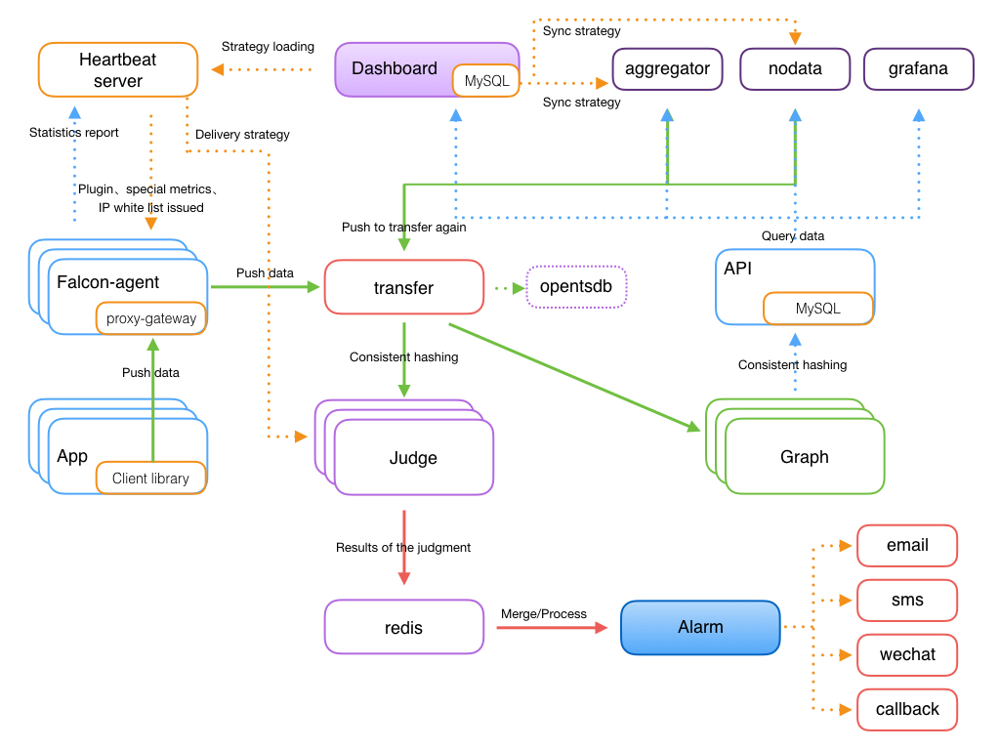

<!-- toc -->

# Introduction

The monitor system is the most important link of the operation process even the lifecycle of a product. It sends alarms before accidents and provides detailed data for the investigation of issues. There are many choices of open source monitor system as a muture product in operation industry. When a company is just estabilshed, the scale of the business is kind of small and the operation department is just set up. So it will save much time and energy choosing an open source monitor system. Afterwards, the scale of the business is getting bigger and more complicated objects need to be monitored. The user of monitor system extends from several SREs to more DEVS and SREs. Therefore, the capacity of the monitor system and "user's efficiency" are the top priorities.

There are so many excellent open source monitor systems in the industry. In the early stage, we were using zabbix. As our business grows and the special need of internet company emerge, the current open source monitor systems does not quite meet the criteria of performance, extendibility and efficiency. 

In the last year, we developed a monitor system of Xiaomi called Open-falcon, based on the need of internet company, the experience and feedback of SREs, SAa and DEVs, and the research of the usage of monitor system in big internet companies. 

**Open-falcon aims at becoming the best monitor product at internet-enterprise-level with the most openness.**

# Highlights and features

- Powerful and flexible data collection: automatic discovery, falcon-agent and snmp supported, user-initiating data push supported, custom plugins supported, opentsdb data model like（timestamp、endpoint、metric、key-value tags）
- Jorizontal extension ability: hundreds of million times of data collection, alarm judging and query in a week
- Alarm policy management with high efficiency: portal of high efficiency; policy template, template inheritance and template overwriting supported; multiple alarm methods and callback invocation supported
- User-friendly alarm configuration:  maximum alarm frequency, alarm level, alarm recovery notification, alarm pause, different thresholds in different periods, maintenance cycle supported. 
- Highly efficient Graph module: capable of sending, filing and saving 2 million metrics in one-minute cycle.
- Highly efficient history data query module: using RRDtool data filing policy that can return the history data of hundreds of metrics in seconds.
- Dashboard：multi-dimensional data display; custom Screen
- High availability：not a core mono-node in the whole system; easy to operate and deploy; horizontal extension supported. 
- Development language: entire back-end of the system written in Golang and Portal and Dashboard in Python.

# Architecture



Falcon-agent is installed in every server. Falcon-agent is a daemon program that is developed in Golang for collecting data and information of all kinds of a machine in autodiscovery. The data and information cover more than 200 indexes that are not exclusive to following ones:

   - CPU
   - Disk
   - IO
   - Load
   - Memory
   - Network
   - Survival of port and process
   - Ntp offset (plugin)
   - Resource consumption  of a process (plugin)
   - Netstat-and-SS-related
   - Configuration of machine's kernel

Once a machine is installed with Falcon-agent, it will automatically collecting data of all indexes and report them without user's configuration of server, which is totally different from zabbix. The advantages are easy maintenance and high coverage. However, it does bring much pressure to server endpoint. Fortunately, the performance of a single module in server endpoint of Open-falcon is high enough, and Open-falcon supports horizontal extension. So it is a good thing to automatically collect more data. Because of that, it is not hard for SREs and DEVs to investigate the issue afterward. 

Besides, Falcon-agent provides a proxy-gateway. Users can easily push data to the gateway of their machine through http port，then gateway will transfer the data to server with high efficiency.

You can find the falcon-agent at our Github: https://github.com/open-falcon/falcon-plus

# Data model

The power and flexibility of Data model is quite important for the "user's efficiency" of a monitor system. Take zabbix as an example. If Hostname (or IP) and metric are sent, users can only add and manage the policy of these two dimensions. Here is a common situation.

Normally speaking, a server has two main partitions: root partition and home partition. If a user want the alarm to be triggered when the free disk space of HostA is less than 5%, then two more rules need to be added to zabbix, even ten more rules for a Hadoop machine with more then ten data disks, which is a problem for automation .(Of course it can be resolved by configuring some autodiscovery  policies in zabbix, but it is still not convenient.

Open-falcon uses the same data format as Opentsdb: metric and endpoint with a couple of key value tags. Here are two examples：

```
{
    metric: load.1min,
    endpoint: open-falcon-host,
    tags: srv=falcon,idc=aws-sgp,group=az1,
    value: 1.5,
    timestamp: `date +%s`,
    counterType: GAUGE,
    step: 60
}
{
    metric: net.port.listen,
    endpoint: open-falcon-host,
    tags: port=3306,
    value: 1,
    timestamp: `date +%s`,
    counterType: GAUGE,
    step: 60
}
```
Through this data architecture, we can configure the alarm and Dashboard in multiple dimensions and so on. 

PS: Endpoint is a special tag.

# Data collection

Transfer receives the data from the clients. After filing and inspection, it sends them to back-end systems for further processing. During the data transfer, it will slice the data according to the consistent hashing algorithm for horizontal extension of back-end business system. 

Transfer provides two porting methods: jsonRpc and telnet. Transfer itself is stateless. There will not be an issue if one or more Transfers stop working. The outstanding performance allows Transfer to transfer more than 5 million pieces of data in a minute.

Currently Transfer supports three types of business back-ends: Judge, Graph, and Opentsdb。Judge is a high-performance alarm judging module developed by us. Graph is a high-performance module developed by us for saving, filing and querying data. And Oopentsdb is an open source service of saving time series data. They can be enabled in the configuration of Transfer.

The data sources of Transfer are:
1. Basic monitor data collected by Falcon-agent
2. Result data of the custom plugins returned by Falcon-agent
3. Client library: The business systems online are all embedded with a unified perfcounter.jar, which will automatically collect and report the qps and latency data of every RPC port in the business system.

PS：Those three types of data will be first sent to the proxy-gateway of the local machine and then transferred to Transfer by gateway.

>Basic monitor can be deployed on any machine (or vessel), like cpu, memory, network, io and disk. The monitor of these indexes are in a fixed way. So users do not need to configure settings or provide extra parameters other than start the Agent, and the data will be collected and reported. Contrary to basic monitor, non-basic monitor requires extra parameters. For example, port monitor needs the specific number of the port or it is invalid even user configures all 65535 port numbers. This type of monitor does not collect data and report them without user's configuration (similar to the configuration-triggered monitor in port monitor and the plugin script monitor in MySQL monitor). 

# Alerting

Judge module is responsible for judging the alert. User's alarm policies configured in web portal are saved in MySQL. Heartbeat Server will regularly load the content of MySQL. And Judge will also keep a regularly communication with Heartbeat Server to retrieve alarm policies.

Heartbeat Server not only loads the content of MySQL, but also calculates the alarm policy of each endpoint for Judge module according to the template inheritance，the template item overlapping, the alarm action overlapping, and the binding between template and Hostgroup. 

Every piece of data transferred by Transfer to Judge will trigger the judging of whether it meets the relevant policy. If is does, the the message is sent to Alarm and Alarm will inform users via mail, SMS, MiTalk and etc. or execute the preset callback address.

Alarm policies are very flexible for users desire. For example, "consecutive N times condition", "consecutive N maximums condition", "different thresholds in different periods", "neglect during maintenance" and etc.

Drastic fluctuation judging and alerting are also supported.

# API

Data are successfully saved in Graph to this step. How can we read the? Data in the past hour, day month, even year needs to be returned in one second.

These are achieved by Graph and API modules. Transfer will send a copy of data to Graph. And then Graph will save them in RRDtool filing method and provide an RPC query port.

API are designed for end users. After receiving query request, it will query different metric data in multiple Graphs and return them in an aggregation. 

# Dashboard


Users can search the endpoint list according to several dimensions in the homepage of Dashboard. In other words, users can search the relevant endpoint by the tags that have been reported. 


Users can add several metrics to a screen. All they need to do for the knowledge of the service state is to take a look at the screen. 


Other features like "view original image", "zoom in/out horizontal ordinate", "quick filtering and invert select" also comply to the "efficiency priority" rule.


An efficient Portal helps users increase efficiency a lot. We feel gratified to see that it will lessen the burden of SREs and DEVs since they seem extremely busy at work.

This is the management page of Host group, which can be connected to the service tree. When a machine comes in and out of a node of the service three, the relevant template will be associated or disassociated. Therefore, it does not need users to bring the service online or offline, which will remarkably increase the efficiency and reduce the omission and false alarm.


One of the easiest example of the template: the template supports inheritance and policy overwriting. Once a template is bound to a hostgroup, the machines in the hostgroup will apply all the policies of the template.


Users can still write an easy expression to monitor when the endpoint is not the machine's name.


It is very easy to add an expression.


# Storage

Saving history data and high-efficiency query are always tough problems for a monitor system.
1. Excessive data: currently our monitor system reports data 2,000 thousands times in each cycle of which half are reported every minute and the other half every five minute. No bottom hours in any day as data are being updated all the time.。
2. Overwhelming writing: writing is usually overwhelmed by reading in common business system. So caching technologies really facilitate data reading. Besides, databases are more efficient in query than writing. However the situation is opposite in monitor system where data writing happens much more frequently than reading. Common databases, like MySQL, postgreaq and mongodb, are not capable of dealing with tens of millions of updates in a period.
3. Efficient query: It does not mean that monitor system is not demanding when we say data writing happens much more frequently than reading. Users usually query the data of hundreds of metrics in the past day, week, month even year. It is quite a challenge to return the data in a second and display them in a diagram.

For the data of diagram, the primary requirement is quick query without information loss. The task of querying the data 100 metrics in the past year is pretty tough on itself. It is difficult to return these data in one second, and the front-end is not able to render this much data unless it samples the data. It is a waste of time and resouce. So we made a plan based on RRDtool. The data of past five years are automatically sampled and filed during the storage. In case of the information loss, the data are sampled and filed by avarage, maximum and minimum. 

```
// 1 point per minute for 12 hours
c.RRA("AVERAGE", 0.5, 1, 720)

// 1 point per 5 minutes for 2 days
c.RRA("AVERAGE", 0.5, 5, 576)
c.RRA("MAX", 0.5, 5, 576)
c.RRA("MIN", 0.5, 5, 576)

// 1 point per 20 minutes for 7 days
c.RRA("AVERAGE", 0.5, 20, 504)
c.RRA("MAX", 0.5, 20, 504)
c.RRA("MIN", 0.5, 20, 504)

// 1 point per 3 hours for 3 months
c.RRA("AVERAGE", 0.5, 180, 766)
c.RRA("MAX", 0.5, 180, 766)
c.RRA("MIN", 0.5, 180, 766)

// 1 point per day for 1 year
c.RRA("AVERAGE", 0.5, 720, 730)
c.RRA("MAX", 0.5, 720, 730)
c.RRA("MIN", 0.5, 720, 730)
```

Transfer will print a copy of the original data to hbase. Or you can let Transfer write the data straight in the Opentsdb.

# Contributors

- [authors](../authors.html)
- [contributing](../contributing.html)
