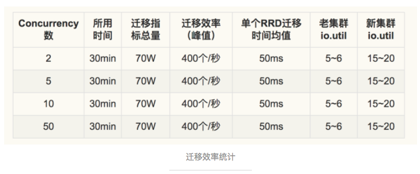

<!-- toc -->

### Preface

The monitor system is the most important link of the operation process even the lifecycle of a product. And Open-falcon is the best monitor product at internet-enterprise-level with the most openness.

The underlying storage of Open-Falcon uses RRDTool database of in time sequence. Transfer and Query module evenly slice the data according to the consistent hashing algorithm. Open-Falcon perfectly meets the needs of the storage of mass data and the query with high speed and efficiency.

When a kind of resource, like storage or IO, reaches the bottleneck, our storage module needs to be expanded to meet the demand and pressure from users. This passage will share our experience and method of expansion with everyone.

### Target Reader

    1.Old Open-Falcon user who needs an expansion but has not done it before.
    2.User who has finished the expansion but still do not understand the whole process.

### Principle

This passage does not concern detailed codes but only brief principle according to the steps of expansion 

From the start when Transfer is edited, the data will flow into the original cluster and the expansion cluster according to the new hashing algorithm. The expansion cluster finds its **migrate switch** is on. Therefore, after it receives the data, the expansion cluster transfers a copy of data according to the old hashing algorithm to the original cluster instead of saving the data first. Finally, it trys to pull the RRD file from the original cluster. If it succedds, it will save the data; if it does not, it will save the data until timeout. 

The query of Query also complys to the **new Hashing algorithm**。When the data of query reach the expansion cluster and the Graph finds out that RRD file already exists in local machine, Graph will return the query result. If RRD file does not exist in local machine, then Graph will pull the old data according to the **old Hashing algorithm** from the original, combines them with its cache data and return an agggregated data to the user.

This entire live data immigration does not have any data loss.

### Defect

The whole plan is pretty stable except for these two detects:

    1. The plan does not have a rollback setting. Once it is started there is no turning back. If the expansion does not succeed, part of the data during the expansion may be lost.
    2. The self-monitor is inadequate. The official index of the expansion only includes the number of files that have been successfully and unsuccessfully immigrated. Users probably cannot know the the detailed information of the expansion. 

### Preparation before expansion

Since this plan has a low fault tolerant rate, we need some preparation before the expansion so we can figure out why the error occurs the first time.

#### Complete Self-Monitor

    【Writing】The number of Transfer receiving point （actual expansion will not affect this value and it is used for comparison）
    【Writing】The number of Transfer transferring point
    【Writing】The number of Graph receiving point
    【Writing】The number of point that the expansion cluster transfers data to the original cluster
    【Reading】The frequency of Query querying Graph
    【Reading】The frequency of Graph transferring query, time consumption and the failing rate
    【Immigration】The number/percentage of successfully immigrated files, the number/percentage of unsuccessfully immigrated files and the immigration latency

#### Function Test

Many have done some modification and customization to an open source Graph, which affects the result of expansion. My former company optimized the memory and the data format stored in it has been changed. However, the hashing algorithm during immigration relys on these data. The hash value calculated by Graph is different from Transfer and part of the data were lost.

So, it is very important to run a accuracy test on the customized version of a company's Graph before expansion.

#### Pressure Test

Different companies has different magnitudes and bottlenecks of monitor system. Generally speaking, data query is overwhelmed by data writing. However, the company where I work reconstructured Judge. Before the query is pushed by Transfer and now it is pulled by Judge. So pressure of query is very big. The ratio of writing and reading basically reached 1:1.

So, it is very important to run a mock pressure test before the expansion.

Here are the results of our mock pressure test:

    Test System: CentOS 7.2
    Memory：8 * 16G
    Disk：3.2TB Nvme SSD
    Expansion：2 machines => 4 machines
    Process：one machine keeps writing 1.3 million points per second and query one million points per second

The results of the test show that all indexes are normal and the consumption of resources is not drastically increasing. The rising concurrency does not increase the expansion efficiency. It indirectly shows that this plan can achieve live immigration when the ratio of writing and reading is 1:1.

### Expansion Process

#### Expansion in Steps

    30 machines  => 31 machines  (grey expansion of one machines)
    31 machines  => 33 machines  (medium data traffic of two machines）
    33 machines  => 38 machines  (more medium data traffic of five machines)
    38 machines  => 50 machines  (full data traffic)

#### Ovservation Index during expansion

    【Basic Index】Memory IO of old cluster and expansion cluster
    【Writing Link】The number of Transfer receives and transfers point; the number of Graph receives point
    【Query Link】The number of time, failing rate and latency of Query querying Graph; the number of time Graph transfers query.
    【Immigration Result】The number immigrated RRD file, the success rate and the immigration time cost.

**The Change of Performance Index during Expansion**

User must strictly follow the steps of expansion every time. If so, they will not observe the gap or fluctuation of data related to the stability of all performance indexes and data. We would like to share the performance indexes and data of several expansions with everyone. (All the concurrency configuration is 5.)

* PS：These data maily show the performance upper bound. The value of IO and memory are all **peak value**
* PPS：Since the company where I work keeps adding new indexes into the monitor system, the value of the index **"the stable time of index immigration"** is not of much meaning for open source Graph.

#### How to Confirm the Expansion is Finished

    1.The receiving indexes of Graph are stable and stay balanced with the transferring indexes of Transfer.
    2.The number of query does not decile anf all the error rates stay stable.
    3.The number of immigrated RRD file the the immigration efficiency tend to be stable at 0 or a fixed value.(0 if no new indexes.)
    4.Mark several indexes that surely will land in the expansion cluster. The data curves of these indexes are all continuous without gaps.

#### Attention

+ Data damage from rebooting
    
      During expansion, the rebooting of the expansion cluster before the RRD file immigration is finished means the expansion has failed.
      During rebooting, the data in memory are forcely saved in the disk, which makes it impossible to immigrate the RRD files that have not been immigrated.

+ Expansion in Batches Recommended

      Since this plan does not have a rollback setting, we recommend users to expand sensitive data in batches.
      In the expansion practice, we did the expansion in batches: greying one machine, then 2 machines in low data traffic, 5 machines, and finally all machines. The the practice proves that expansion in batches is totally doable, safe and can lower the risk.

### Summary

This plan is doable, stable and operable. The expansion can easily succeed as long as the operators have been fully prepared and aware of the expansion process.

### Appendix: The Change of Index during Expansion

The change of the number of immigrated RRD file:

Old cluster IO.util:

New cluster IO.read.MB:

New cluster IO.write.MB:

> Author：[Jiasheng Gao](http://blog.gaojiasheng.com/) [An Nie](https://github.com/niean) [Wei Qian](https://github.com/n4mine)

    Link：http://www.jianshu.com/p/a87ab10e09c7
    From：Jianshu

> References：
- [The Automatic immigration of the history fata of Graph - laiwei](http://www.jianshu.com/p/16baba04c959)
