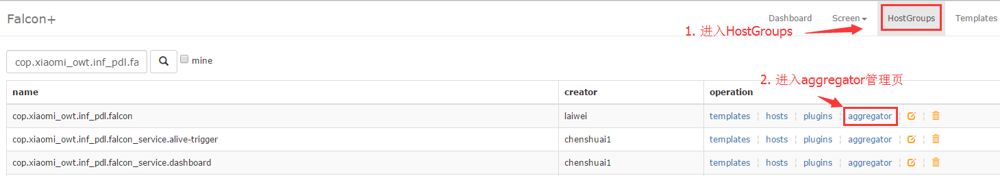

<!-- toc -->

# Cluster Aggregation

The essential of cluster monitor is the feature of aggregation.

The monitor index of a single machine is hard to reflect the state of the whole cluster. We need to aggregate all the machines in the cluster (like all the machines in a Hostgroup) as a entity. The qps of the cluster is the grand total of the qps of each machine. The query failing rate of the cluster = the sum of the request_fail of all the machines ÷ the sum of the request_total of all the machines. 

After we calculating the aggregated index of the cluster, we probably also need to check its history tendence and set an alarm for this index. Therefore, we push the index back to the server of the monitor system. So you can treat it as a normal piece of monitor data.

The background inforamtion is clear. Now let me introduce the realization of cluster aggregation.

First, user needs to add a rule of cluster aggregation in a HostGroup. Then we can say that it applies to all the machines in the HostGroup
Second, the calculation of the cluster index is division. So there must be a numerator and a denominator.

* Situation 1：In the situation where the qps of the cluster is the grand total of the qps of each machine, each machine should have a counter for qps, which is written within `$()`. Therefore, the numerator can be `$(qps/module=judge,project=falcon)` and the denominator is 1.
* Situation 2：The query failing rate of the cluster = the sum of the request_fail of all the machines ÷ the sum of the request_total of all the machines. The numerator is $(request_fail/module=graph,project=falcon) and the denominator is $(request_total/module=graph,project=falcon)  
* Situation 3：Calculating the ratio of machine whose CPU usage is over 40% in the cluster. This situation is called **cluster percentage** and it is a comparison. The numerator is `$(cpu.busy)>40` and the denominator is $#. The comparison of ">", "<", "=", ">=", and "<=" is also supported.

The difference between situation 1 and situation 3 lies in the numerator. The numerator in situation 1 is the grand total of the value of all the specified counters. If three counters of the machine are 2,4, and 5, then the numerator is 2+4+5=11. In situation 3, the numerator equals the number of machine that matched the condition. If three counters of the machine are 29,41, and 45, then the numerator is 0+1+1=2. 

Besides, addition and subtraction calculations are also supported in the numerator, not multiplication, division and brackets. For example `$(cpu.idle) + $(cpu.busy) ` it is valid even though it is meaningless.

The numerator and denominator not only support counters but also pure numbers and `$#`. `$#` in shell programming is stands for the number of parameter just like here.

If you want to do the addition and subtraction first, you need to put them in the brackets, just like the normal algebraic operation. For example, in `($(cpu.idle) + $(cpu.busy)) > 40`, the system will first do the addition then the comparison. 

As for the numerator, we check the latest value of all the counters of the machine in a Hostgroup and add them up. (The numerator calculated by different machines should be summed up.) But the value of some machine cannot be found. `$#` stands for the number of value that should be found. If one expression concerns three counters, the expression will not use their value unless three values of the counter are found. Once a value of counter is missing, this machine is ignored.
 
Here are some configuration examples:
```
# Legal: calculating the average qps of the cluster
Numerator: $(qps/module=judge,project=falcon)
Denominator: $#
  
# Legal: calculating the sum qps of the cluster
Numerator: $(qps/module=judge,project=falcon)
Denominator: 1
  
# Legal: Calculating the ratio of machine whose CPU usage is over 40% in the cluster
Numerator: $(disk.io.util)>=40
Denominator: 1
  
# Legal: Calculating the ratio of diso.io.util that is over 40% in the cluster
Numerator: $(disk.io.util)>40
Denominator: #
  
# Legal: calculating the number of machine in which cpu.idle + cpu.busy equals 100
Numerator: ($(cpu.idle) + $(cpu.busy)) = 100
Denominator: 1
 
# Legal: the numerator and denominator is Counter only for example
Numerator: $(cpu.busy)
Denominator: $(cpu.busy)
  
# Illegal: calculation including addition and subtraction without using brackets 
Numerator: $(cpu.idle) + $(cpu.busy) > 40
Denominator: 1
  
# Illegal: no counter in the numerator or denominator
Numerator: $#
Denominator: 1
  
# Illegal: variable and numbers are mixed together in addition and subtraction
Numerator: ($(cpu.idle) + $(cpu.busy) - 60) > 100
Denominator: 1
```

Note：At least one counter should be in the numerator or denominator. They cannot all be pure numbers or $# because it is meaningless. Besides the numerator or denominator, there are other configurations like endpoint, metric, tags, step and etc. There are used when the data need to be pushed back to the server of the monitot system. The monitor data have so many fields and no one can be left out. We can calculate the value and timestamp of the index of cluster monitor, but we cannot automatically fill up the field of endpoint, metric, tags, step and etc. So they still need to be filled manually by users.


## User Manuals
Users need to configure two items when they want to use cluster monitor: cluster aggregation and alarm strategy. We would like to introduce how to use the service provided by aggregated cluster monitor through an example.

### User Demand
Calculate the ratio of the machine whose cpu.busy is over 80 in cop.xiaomi_owt.inf_pdl.falcon of the cluster. Inform the user when it reaches the threshold.。

### Configuration of Cluster Aggregation 
Visit HostGroup and search the node cop.xiaomi_owt.inf_pdl.falcon，then click the aggregator link next to it，enter the aggregator list of the current node like the picture below:：


Click the "create" button in the top-right to enter the editing page of aggregator like the picture below:


PS：Endpoint is better bound to HostGroup so it is convenient to use the template in alarm configuration; or users have to use Expression.

### Configuration of the Template Strategy
Take the template of alarm as an example. After configuring aggregator, if you want to receive the alarm about the aggregated value, you need to configure the monitor strategy in the template that is bound to  **the node where Endpoint is**.


### Configuration of Strategy Expression
[Strategy Expression](../philosophy/tags-and-hostgroup.md)

Skip this part if you have configured template strategy.