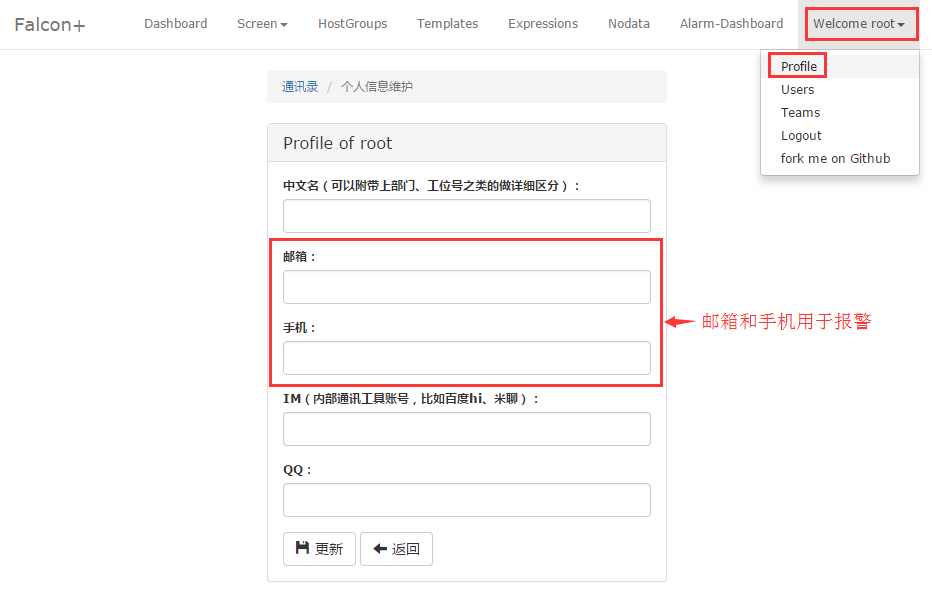
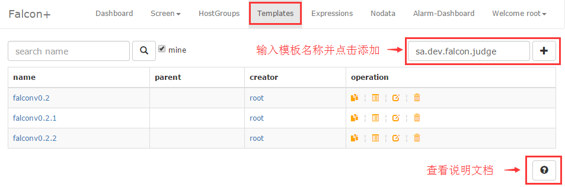

<!-- toc -->

The system has been constructed. How to use it? Here is the introduction of the system.

# Viewing Monitor data

Agent will automatically collect data as long as it is deployed in the machine and configured with Heartbeat and Transfer. We can view the monitor data in Dashboard. Dashboard is a web application that can be visited through browser. Search the point in the left. What is endpoint? What do I use to search an endpoint? The endpoint is the machine name for all the data collected by Agent. Execute `hostname` on the target machine and what is outputs is the endpoint. Then users can search this hostname.

When you see the search result, check the multi-selection box in front of it and click "view counter list". All the counters belonging to this endpoint are listed. What is counter?`counter=${metric}/sorted(${tags})`

If we want to view cpu.busy, then enter cpu in the counter search box and press enter. Click cpu.busy when you see it and you will open a new page that displays the data of cpu.busy in the last hour. If you want the data in a longer history, click the little triangle in the top right, open the menu, and choose a longer time span.

- - - - -

# How to Configure Alarm Strategy

We have introduced how to vew monitor data in the last part. How to configure an alarm strategy when the data, like cpu.busy, reaches the threshold?

## Configure the Alarm Recipient

The alarm recipient in Falcon is not a specific cell phone number or mail address because user ofthen change them. It will be so inconvenient to edit all the configuration when a phone number and mail address changes. We save all the user contact information in `account/Profile`. Users only need to change their own contact information there. The alarm recipient is not a single person but a team or teams. If any module in Falcon has any problems, the alarm should be sent to the operation team and developers of Falcon. Therefore, new employees only need to join the team of Falcon and quit the team after dimission.

Visit UIC through browser. If LDAP is enabled then log in using LDAP account. If not enabled, please contact the administrator for an account. Create a team called Falcon (for now) for the later test.

First, Update account information and make sure the phone number and mail address are correct.

Then add alarm team anf the group member.

- - - - 

## Create a HostGroup

For example, we need to monitor the port of the falcon-judge component. we need to create a hostgroup first and add all the machines deployed with Judge module of Falcon. Users can just add or remove machines for future expansion or offline and the strategy will automatically become valid or invalid. For now, we call this HostGroup sa.dev.falcon.judge. This name says a lot: "sa" is our department, "dev" is our group, "falcon" is the project name and "judge" is the module name. We recommend this name pattern because it facilitates the management.

If an error occurs when adding a machines in the hostgroup, you need you check whether the machine is in the host list in portal database. Where do the machine in the host list come from? Agent hs a heartbeat(hbs) configuration. Agent will send the heartbeat every minute to hbs, telling its information, like ip, hostname, agent version and etc., to hbs and hbs write them down in the host list. If no data are in the host list, then you should check whether this link is still working.

## Create A Strategy Template

There is a Templates link on the top of portal and that is the entrance of strategy template managemant. We create a template in in called sa.dev.falcon.judge.tpl just like the name of the HostGroup and configure a port monitor in it. Generally, there are two methods of process monitoring. One is to see if the process itself is alive, and the other is to see if the port is monitoring. Here we use port monitoring.

- - - - -

The plus sign on the top right is for adding strategy. We only have one strategy in the template but it can have several strategies. Down below is the alarm recipient congifuration. We fill in "falcon" which is created in the previous UIC.

## Binding the Hostgroup to the Template

One template can bound to multiple HostGroups. Now we return to the HostGroup page and find the HostGroup "sa.dev.falcon.judge". On the right side thre are some links. Click 【templates】 and enter a new page. Enter the name of the template and bind it.

- - - - -

## Complementary Information

After those steps, the configuration is done. If Judge breaks down, the port stops monitoring and the alarm will be triggerred. But please do not disable Judge module for alarm test. Because Judge itself is for judging alarm. It cannot judge when it is disabled. Therefore, the current Falcon is not perfect since it cannot monitor the module in itself. If you want to test it, please change the port to the one that is not monitoring in the strategy of port monitor, then the alarm will be triggerred.。

The strategy above only monitor the port of Judge. What if we want to add some loading monitor to all the machines in the falcon project?

1. Create a HostGroup: sa.dev.falcon, add all falcon machines in it
2. Create a template: sa.dev.falcon.common, add some strategies like cpu.idle, load.1min, etc.
3. Bind sa.dev.falcon.common to HostGroup sa.dev.falcon

PS：the configuration example of sa.dev.falcon.common

You may not know what the name of each metric, but you must know the metric of youself. Please refer to https://github.com/open-falcon/agent/tree/master/funcs for the data pushed by Agent.

# How to Configure Stratey Expression

You can visit [Philosophy of HostGroup and Tags](../philosophy/tags-and-hostgroup.md) for the information of expression. Here is an example：

The configuration in the example above means: endpoint=aggregator and the alarm is sent to `falcon-test1` team if all the metrics in metric=cpu.busy are no less then 0.5 in consecutive three times. 

Expression does not need to be bound to HostGroup.