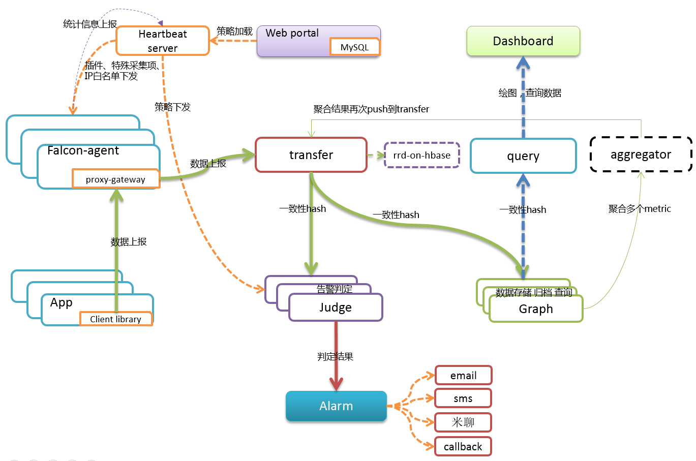

# 概述

Open-Falcon是一个比较大的分布式系统，有十几个组件。按照功能，这十几个组件可以划分为 基础组件、作图链路组件和报警链路组件，其安装部署的架构如下图所示，

## 在单台机器上快速安装

请直接参考[quick_install](../quick_install/README.md)

## Docker化的Open-Falcon安装

参考：
- https://github.com/open-falcon/falcon-plus/blob/master/docker/README.md
- https://github.com/open-falcon/dashboard/blob/master/README.md

## 在多台机器上分布式安装

在多台机器上，分布式安装open-falcon，就是本章的内容，请按照本章节的顺序，安装每个组件。

## 视频教程教你安装

《[Open-Falcon部署与架构解析](http://www.jikexueyuan.com/course/1651.html)》

