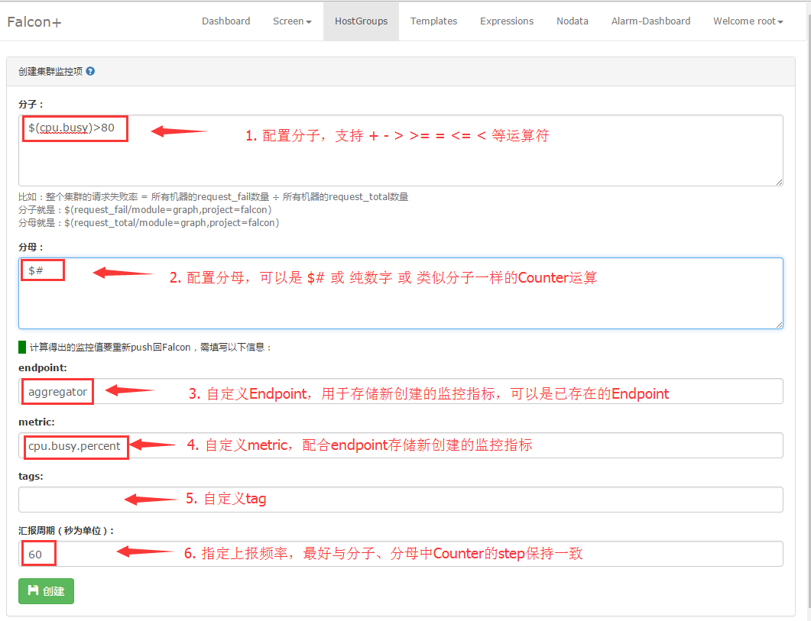

# 集群聚合

集群监控的本质是一个聚合功能。

单台机器的监控指标难以反应整个集群的情况，我们需要把整个集群的机器（体现为某个HostGroup下的机器）综合起来看。比如所有机器的qps加和才是整个集群的qps，所有机器的request_fail数量 ÷ 所有机器的request_total数量=整个集群的请求失败率。

我们计算出集群的某个整体指标之后，也会有“查看该指标的历史趋势图” “为该指标配置报警” 这种需求，故而，我们会把这个指标重新push回监控server端，于是，你就可以把它当成一个普通监控数据来对待了。

背景交代清楚了……现在来介绍我们的实现……

首先，用户要在某个HostGroup下添加集群聚合规则，我们就知道这个规则涵盖的机器是当前这个HostGroup下的所有机器。
其次，整个集群的指标计算是一个除法，除法的话就有分子，有分母。

* 场景一：“所有机器的qps加和才是整个集群的qps” 这个场景中每个机器应该有个qps的counter，每个counter在书写的时候要求用`$()`包裹起来，故而，分子可以这么描述：`$(qps/module=judge,project=falcon)`，分母就填写 1 就行了。
* 场景二：“所有机器的request_fail数量 ÷ 所有机器的request_total数量=整个集群的请求失败率” 分子就是：`$(request_fail/module=graph,project=falcon)` 分母就是：`$(request_total/module=graph,project=falcon)` 
* 场景三：“集群中cpu使用使用率大于40%的机器比例” 这个场景我们称为**集群百分比**，这是比较运算，分子是`$(cpu.busy)>40`，分母就是$#，当然同时支持" >  <  =   >=  <= "五种比较运算
场景一和场景三的区别：以分子为例，前者是累加指定counter返回的数值，如集群中三个机器分别返回2，4，5，则分子为 2+4+5=11；后者是如果counter符合条件则分子加1，如三个机器分别返回29，41，45，则分子为 0+1+1=2

另外，对于分子和分母，我们是支持加减计算的，不过不支持除法、乘法、括号，举个没意义的分母：`$(cpu.idle) + $(cpu.busy) `，可以两个counter相加

分子和分母不但支持配置counter，也支持配置成纯数字，支持配置 `$#`，`$#`在shell编程中是参数个数的意思，我们这里也类似。

如果是比较运算中使用加减法，需要使用()括起来，就像常规运算中优先级一样，比如：`($(cpu.idle) + $(cpu.busy)) > 40`，两个counter相加之后再作比较运算

对于分子而言，我们就会拿着HostGroup下的所有机器去查询相对counter的最新值，然后把所有值相加（不同机器计算出来的分子要相加），但是有的机器可能查不到数据，`$#`表示的是正常查到数据的机器数量。整个表达式假设涉及到3个counter，对某个机器而言，必须3个counter都查到数据才被使用，只要有一个counter没有查到数据，那就忽略这个机器。
 
下面列举些配置实例：
```
# 合法 计算集群qps平均值
分子：$(qps/module=judge,project=falcon)
分母：$#
  
# 合法 计算集群qps总值
分子：$(qps/module=judge,project=falcon)
分母：1
  
# 合法 计算集群disk.io.util大于等于40%的机器个数
分子：$(disk.io.util)>=40
分母：1
  
# 合法 计算整个集群diso.io.util大于40%的比率
分子：$(disk.io.util)>40
分母：$#
  
# 合法 计算集群中cpu.idle + cpu.busy为100的机器个数
分子：($(cpu.idle) + $(cpu.busy)) = 100
分母：1
 
# 合法 分母与分子配置无差别，都可使用Counter，仅举个例子
分子：$(cpu.busy)
分母：$(cpu.busy)
  
# 非法 对于使用了加减去处的比较运算，需要使用( )
分子：$(cpu.idle) + $(cpu.busy) > 40
分母：1
  
# 非法 分子和分母至少配置一个counter
分子：$#
分母：1
  
# 非法 加减运算中变量和数字不能混合使用
分子：($(cpu.idle) + $(cpu.busy) - 60) > 100
分母：1
```

注意：分子、分母中至少配置一个counter，不能都配置成纯数字或$#，因为这种配置是没啥意义的。除了配置分子、分母之外，还有很多其他配置，比如endpoint、metric、tags、step等等，这些是为了把数据重新push回监控server的时候用的。监控的数据有好几个字段，缺一不可，我们可以计算出集群监控指标的value和时间戳，但是无法自动填充endpoint、metric、tags、step等字段，所以，仍然要用户手工填写。


## 用户手册
使用集群聚合监控，需要进行两个配置: 集群聚合 和 报警策略。下面，我们以一个例子，讲述如何使用集群聚合监控提供的服务。

### 用户需求
获取节点cop.xiaomi_owt.inf_pdl.falcon下cpu.busy>80的机器在集群中所占比例，达到阈值后通知给用户。

### 集群聚合配置
访问HostGroup，搜索节点cop.xiaomi_owt.inf_pdl.falcon，点击后面的aggregator链接，进入当前节点对应的aggregator列表，如下图所示：


点击右上角的“新建”按钮，可进入aggregator编辑页面，如下图所示：


注：Endpoint最好是跟HostGroup有绑定关系，这样方便使用模板来配置报警；否则需要Expression来配置报警

### 模板策略配置
下面以报警模板为例，配置了aggregator后，如果想收到关于聚合的值的报警，需要在 **Endpoint所在的节点** 绑定的模板里面配下监控策略：


### 策略表达式配置
如果已经配置模板策略，就不用再配置 [策略表达式](../philosophy/tags-and-hostgroup.md)
