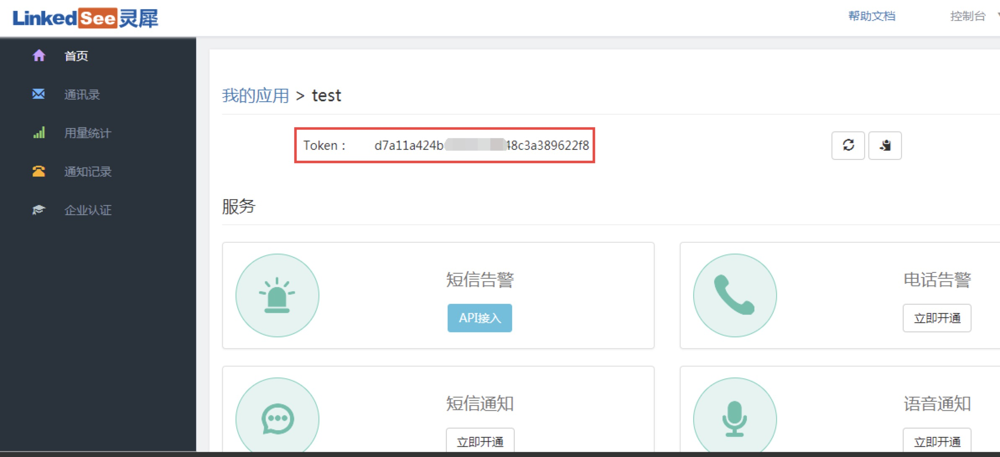

<!-- toc -->

# 邮件、短信、微信、电话发送接口

监控系统产生报警事件之后需要发送报警邮件或者报警短信，各个公司可能有自己的邮件服务器，有自己的邮件发送方法；有自己的短信通道，有自己的短信发送方法。falcon为了适配各个公司，在接入方案上做了一个规范，需要各公司提供http的短信和邮件发送接口。

##### 短信发送http接口：

```
method: post
params:
  - content: 短信内容
  - tos: 使用逗号分隔的多个手机号
```

#####邮件发送http接口：

```
method: post
params:
  - content: 邮件内容
  - subject: 邮件标题
  - tos: 使用逗号分隔的多个邮件地址
```

##### im发送http接口：

```
method: post
params:
  - content: im内容
  - tos: 使用逗号分隔的多个im号码
```

不过你可以使用社区提供的 `邮件发送网关` 和 `微信网关`，或者使用灵犀提供的 [云告警通道](http://t.cn/RpkS0d2)。

- [邮件网关](https://github.com/open-falcon/mail-provider)
- [微信网关](https://github.com/Yanjunhui/chat)

----
# LinkedSee灵犀云通道短信/语音通知接入
目前open-falcon支持LinkedSee灵犀云通道短信/语音通知API快速接入，只需一个API即可快速对接Open Falcon，快速让您拥有告警通知功能，90%的告警压缩比。云通道短信/语音通知接口接入步骤如下：

#### 1、注册开通LinkedSee灵犀云通道
LinkedSee灵犀云通道是专为IT运维打造的专属告警通道，多通道接入，最大程度避免堵塞，支持基于通知内容关键字的分析，合并同类事件，可以帮助您快速定位故障问题。访问LinkedSee灵犀标准版官网地址：[注册地址](http://t.cn/RpkS0d2)
，注册灵犀账号，直接开通云通道服务。若已有账号，则直接登录即可。


 
#### 2、创建应用
注册成功后，登录系统进入控制台后，点击云通道进入工作台页面。击新建应用，创建应用，如下所示，输入应用名称之后点击保存。
 

目前云通道提供短信告警、电话告警、短信通知、语音通知等4种使用场景，创建应用时默认开通短信告警和电话告警两种方式，为保证能正常接收到所有语音和短信告警，应确保短信和电话告警两种方式是打开状态。

#### 3、获取应用token
创建应用成功之后 ，点击查看应用token，如下所示：

<font color="blue">附注：token在后续的api接入步骤中使用。请复制后保存，以备后续使用。</font>
 

#### 4、获取token后拼接URL
获取token后，需要跟LinkSee灵犀云通道的短信和语音告警url进行拼接：

- 发送短信通知地址为：https://www.linkedsee.com/alarm/falcon_sms/`this_is_your_token`
- 发送语音通知地址为：https://www.linkedsee.com/alarm/falcon_voice/`this_is_your_token`

如若目前创建的应用的token为：d7a11a42aeac6848c3a389622f8，则：

- 发送短信地址为：https://www.linkedsee.com/alarm/falcon_sms/d7a11a42aeac6848c3a389622f8
- 发送语音告警的地址为：https://www.linkedsee.com/alarm/falcon_voice/d7a11a42aeac6848c3a389622f8

#### 5、配置open-falcon：
将上面的url配置在open-falcon alarm模块的配置文件cfg.json中，可以基于cfg.example.json修改，目前直接适配open-falcon v0.2。接口部分如下所示：

```  
"api": {
        "im": "http://127.0.0.1:10086/wechat",  //微信发送网关地址 
        "sms": "http://127.0.0.1:10086/sms",  //短信发送网关地址
        "mail": "http://127.0.0.1:10086/mail", //邮件发送网关地址
        "dashboard": "http://127.0.0.1:8081",  //dashboard模块的运行地址
        "plus_api":"http://127.0.0.1:8080",   //falcon-plus api模块的运行地址
        "plus_api_token": "default-token-used-in-server-side" //用于和falcon-plus api模块服务端之间的通信认证token
    }
```
将step4的URL写在截图红框处， 如下所示：

 
若发短信，则把短信发送网关地址替换为上一步中拼接的URL；若要发送语音消息，则将sms处的地址替换为语音对应的url。目前falcon暂不支持同时发送语音和短信通知，若要同时使用语音和短信报警，可以开通linkedsee云告警服务，同时还支持微信和邮件报警。

#### 6、触发告警
Open-Falcon配置完成后，请您触发一条告警，检查是否配置成功。目前Open-Falcon接入LinkedSee灵犀云通道之后，语⾳播报通道是固定内容的语⾳，若想使⽤动态语音播报和更多高级告警功能，欢迎使用云告警产品。>>[接入帮助](https://www.linkedsee.com/standard/support/#/access-falcon)

<font color="blue">附注：如果未成功，请确认是否按照上述步骤进行配置。如果确认没有问题，可以联系我们。我们将及时为您提供支持。热线电话：010-84148522 </font>

#### 7、认证充值
目前云通道免费版默认为短信10条，电话10通，完成接入配置之后，为保证信息安全，需要点击申请企业认证，填写企业认证相关信息审核通过之后即可充值购买更多的短信和语音告警数量。充值成功之后 ，可以查看用量统计和通知记录，帮助您更好的监控硬件性能，提升效率。

  
#### 欢迎体验LinkedSee云告警高级服务
- 一分钟拥有短信、微信、邮件、电话四种告警通知方式；
- 支持告警升级策略、排班表及关键字合并策略；
- 可以支持指定时间窗内的告警接收数量；
- 多个维度的数据分析,更好的支持个性化需求；
